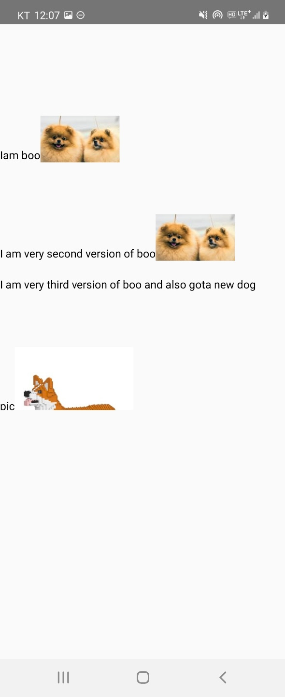

# remote-component-testbed

```tsx
import { RemoteComponent } from './RemoteComponent';

export default function App() {
  return (
    <View style={{ marginTop: 50 }}>
      <View style={{ height: 20 }} />
      <RemoteComponent
        url="https://raw.githubusercontent.com/pjc0247/remote-component-testbed/main/bundles/bundle_bc5674a8-90d3-43c4-8a5d-30a4aca1db6f/"
      />
      <View style={{ height: 20 }} />
      <RemoteComponent
        url="https://raw.githubusercontent.com/pjc0247/remote-component-testbed/main/bundles/bundle_871d6621-285f-45a2-b0e9-99939756321a/"
      />
      <View style={{ height: 20 }} />
      <RemoteComponent
        url="https://raw.githubusercontent.com/pjc0247/remote-component-testbed/main/bundles/bundle_d48a0117-608a-4553-8484-3ac4f55d096c/"
      />
    </View>
  );
};
```

